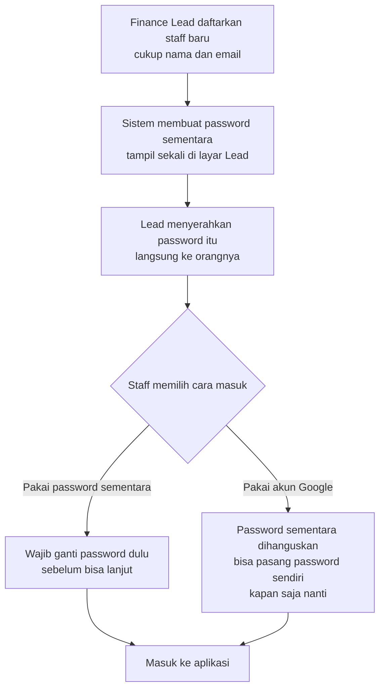

# Akun & Akses Pengguna — Gambaran Umum

Dokumen ini menjelaskan **siapa saja yang bisa memakai Sentinel dan bagaimana mereka mendapat akses**, tanpa istilah teknis. Untuk detail implementasi, lihat `auth_user_technical.md`.

---

## Siapa yang memakai aplikasi ini

Sentinel dipakai **khusus oleh tim finance**. Tidak ada tipe pengguna lain — tidak ada murid, guru, klien, atau publik.

Di dalam tim finance hanya ada **dua jenis orang**:

| | **Finance Staff** | **Finance Lead** |
| :--- | :--- | :--- |
| Jumlah | Banyak | Biasanya satu |
| Pekerjaan harian | Mencatat dan menelusuri transaksi | Sama persis dengan staff |
| Tambahan | — | Mengelola akun anggota tim |

Perbedaannya **hanya satu**: Finance Lead bisa menambah dan menonaktifkan akun. Di luar itu keduanya identik — melihat data yang sama, mengerjakan hal yang sama.

> **Yang sengaja tidak ada:** tidak ada tingkatan jabatan, tidak ada pembagian per departemen, dan tidak ada data yang disembunyikan dari sebagian orang. Semua anggota tim finance melihat seluruh transaksi.

---

## Bagaimana orang baru mendapat akses

**Tidak ada pendaftaran mandiri.** Orang tidak bisa membuat akunnya sendiri. Satu-satunya cara masuk ke sistem adalah **didaftarkan oleh Finance Lead**.

Ini disengaja: aplikasi ini menyimpan data keuangan perusahaan, jadi daftar orang yang boleh masuk harus terkendali penuh.

---

## Dua cara masuk, satu akun yang sama

Setiap orang punya **satu akun** yang dikenali lewat **alamat email**-nya. Email itulah identitasnya. Ada dua cara membuktikan bahwa dia memang pemilik akun tersebut:

**Cara 1 — Email dan password.** Cara biasa. Password ditentukan sendiri oleh pemilik akun setelah login pertama.

**Cara 2 — Tombol "Masuk dengan Google".** Jika email yang terdaftar kebetulan adalah akun Google, orang tersebut bisa langsung masuk tanpa mengetik password sama sekali.

Yang penting dipahami: **ini bukan dua akun yang berbeda.** Orang yang sama, akun yang sama, data yang sama — cuma pintu masuknya yang berbeda. Seseorang bisa berganti-ganti cara kapan saja.

Satu hal yang mungkin terasa mengejutkan tapi memang disengaja: **kalau seseorang memilih masuk lewat Google, password sementaranya langsung dimatikan.** Alasannya sederhana — password itu tadi dikirim lewat chat atau disebutkan lisan, jadi ia berpotensi bocor. Begitu terbukti tidak dibutuhkan, ia dibuang.

Yang dimatikan **hanya password sementara pemberian Finance Lead, bukan kemampuan memakai password.** Orang tersebut tetap bisa **memasang password miliknya sendiri kapan saja** lewat Pengaturan Akun. Setelah itu dia punya dua pintu masuk yang sama-sama berlaku: password sendiri, atau Google. Jadi tidak ada yang terkunci menjadi "Google saja" tanpa memilihnya sendiri.

---

## Kejadian sehari-hari

**Ada anggota baru bergabung.** Finance Lead mendaftarkan nama dan emailnya, lalu menyerahkan password sementara. Anggota baru masuk, mengganti password, dan langsung bisa bekerja. Selesai dalam hitungan menit.

**Ada yang lupa password.** Tidak ada fitur "lupa password" lewat email, karena sistem ini belum mengirim email. Solusinya: minta Finance Lead membuatkan password sementara yang baru. Prosesnya sama seperti anggota baru. Kalau orang tersebut punya akun Google, dia bahkan tidak perlu menunggu — tinggal masuk lewat Google.

**Ada yang resign.** Finance Lead menonaktifkan akunnya. Akses langsung tertutup, tapi **seluruh transaksi yang pernah dia catat tetap utuh dan tetap tercantum atas namanya.** Ini penting: ini aplikasi audit, jejak siapa mencatat apa tidak boleh hilang. Karena itu akun tidak pernah benar-benar dihapus, hanya dimatikan.

**Ada yang kembali bergabung.** Finance Lead cukup mengaktifkan kembali akun lamanya.

---

## Prinsip keamanan yang dipegang

- **Password sementara hanya bisa dilihat sekali.** Setelah layar ditutup, tidak ada seorang pun — termasuk Finance Lead — yang bisa melihatnya lagi. Kalau hilang, buat yang baru.
- **Sistem tidak pernah memberi tahu apakah suatu email terdaftar.** Salah password dan email tidak dikenal menghasilkan pesan yang persis sama. Ini mencegah orang luar menebak-nebak siapa saja yang bekerja di tim finance.
- **Masuk lewat Google tidak otomatis membuat akun.** Orang dengan akun Google yang emailnya belum didaftarkan Finance Lead tetap ditolak. Google hanya membuktikan identitas, bukan memberi izin masuk.
- **Akun tidak pernah dihapus permanen**, hanya dinonaktifkan — demi menjaga jejak audit.

---

## Batasan yang disadari

Beberapa hal sengaja belum dibuat di tahap ini, supaya tim bisa fokus:

- **Sistem tidak mengirim email apa pun.** Semua penyerahan password dilakukan langsung antar orang.
- **Finance Lead tidak bisa mengangkat orang lain menjadi Lead** lewat aplikasi. Perubahan seperti itu dilakukan oleh tim teknis.
- **Tidak ada riwayat login** atau catatan siapa mengubah pengaturan akun siapa.
- **Password sementara berpindah tangan secara manual**, sehingga keamanannya bergantung pada kehati-hatian Finance Lead saat menyerahkannya.
