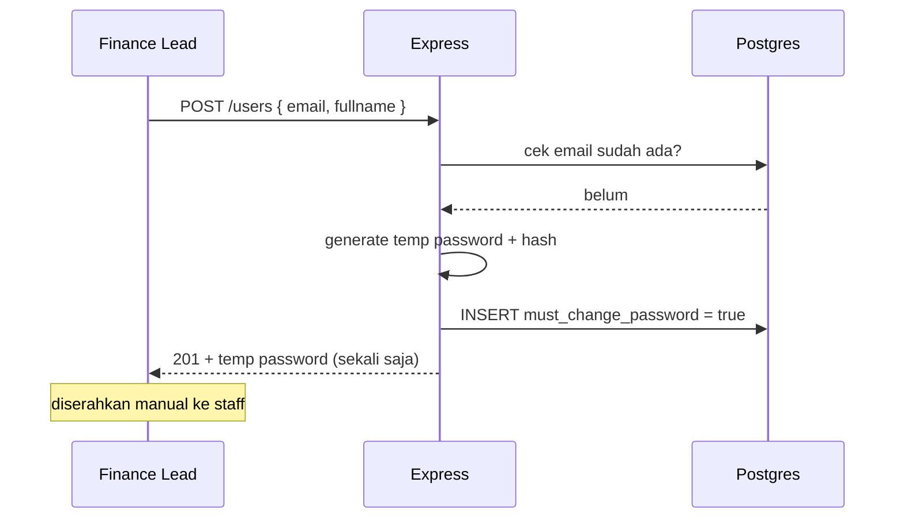
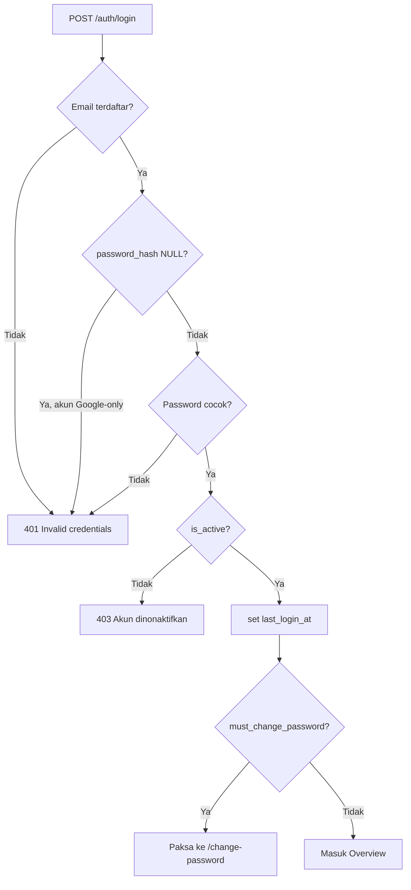
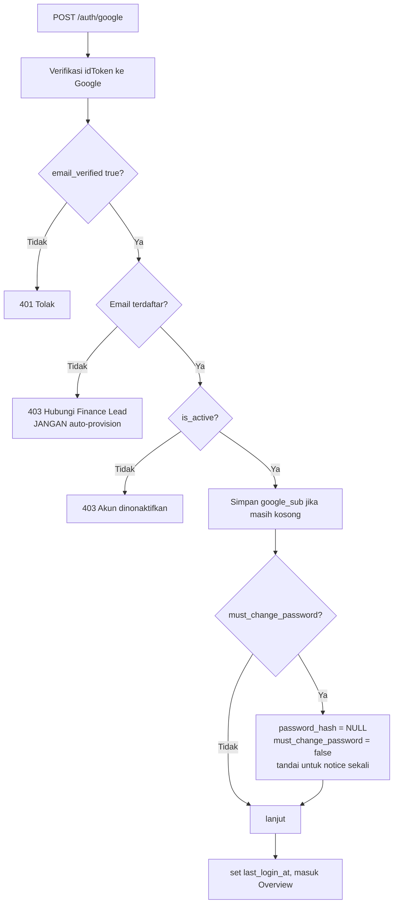

# Auth & User Service — Spesifikasi Teknis

Acuan tim untuk mendesain modul auth + user, Sprint 1 (tanpa AI service).
Versi non-teknis: `auth_user_overview.md`.

---

## Tabel `users`

```sql
users (
  id                   serial PRIMARY KEY,
  email                varchar(255) UNIQUE NOT NULL,   -- identitas login, selalu lowercase
  fullname             varchar(100) NOT NULL,
  password_hash        varchar(255),                    -- NULL = akun Google-only
  google_sub           varchar(255) UNIQUE,             -- diisi saat login Google pertama
  is_admin             boolean NOT NULL DEFAULT false,  -- true = Finance Lead
  must_change_password boolean NOT NULL DEFAULT false,
  is_active            boolean NOT NULL DEFAULT true,
  last_login_at        timestamptz,                     -- NULL = badge "Pending"
  created_at           timestamptz NOT NULL DEFAULT now(),
  updated_at           timestamptz
)
```

**Dihapus dari skema lama:** `username`, `role`, `department`.
**Tidak ada hard delete** — user dirujuk `transactions.input_by_user_id`, jadi hanya `is_active = false`.
**`password_hash` nullable** — inilah yang memungkinkan akun Google-only.

## Model privilege

| Tipe | Flag | Akses |
| :--- | :--- | :--- |
| Finance Staff (member) | `is_admin = false` | Seluruh fitur transaksi & vendor |
| Finance Lead (admin) | `is_admin = true` | Sama persis + 4 endpoint `/users` |

- Bukan RBAC. `is_admin` adalah **satu-satunya** bit privilege di seluruh aplikasi.
- Bit itu **hanya** menjaga `/users`. Tidak ada endpoint lain yang boleh mengeceknya.
- Tidak ada penyaringan data per user. Semua orang melihat transaksi & vendor yang sama.
- Status admin tidak dapat diubah lewat aplikasi — hanya lewat seed script.

## Endpoint

| Method | Path | Akses | Body / Catatan |
| :--- | :--- | :--- | :--- |
| POST | `/auth/login` | publik | `{ email, password }` |
| POST | `/auth/google` | publik | `{ idToken }` |
| GET | `/auth/me` | login | Profil user aktif |
| POST | `/auth/change-password` | login | `{ currentPassword, newPassword }` — **400** jika `password_hash` NULL |
| POST | `/auth/set-password` | login | `{ newPassword }` — **400** jika `password_hash` sudah terisi |
| POST | `/auth/logout` | login | Hanya perlu jika pakai cookie (OD-2) |
| GET | `/users` | **admin** | List + status Pending / Active / Inactive |
| POST | `/users` | **admin** | `{ email, fullname }` → temp password dikembalikan **sekali** |
| POST | `/users/:id/reset-password` | **admin** | Temp password baru, dikembalikan sekali |
| PATCH | `/users/:id/status` | **admin** | `{ isActive }` |

Non-admin menembak `/users` → **403**, walaupun menunya sudah disembunyikan di UI. Sembunyikan menu saja tidak dianggap pengamanan.

---

## Alur

### Bootstrap
Finance Lead pertama dibuat lewat seed script yang idempoten. **Tidak ada endpoint** untuk ini — `POST /users` sendiri membutuhkan admin yang sudah ada.

### Onboarding staff baru



Email duplikat → **409**. Temp password tidak pernah bisa dibaca ulang lewat endpoint mana pun.

### Login password



Ketiga cabang menuju `X` **wajib mengembalikan pesan yang identik** — jangan bocorkan akun mana yang eksis atau berjenis apa.

### Login Google



Langkah `H` adalah aturan **temp password hangus**: password yang sempat beredar lewat chat atau lisan dimatikan begitu terbukti tidak dipakai.

Yang dihanguskan **hanya kredensial sementaranya, bukan kemampuan login password.** User tetap bisa memasang password sendiri kapan saja lewat `/auth/set-password`. Karena itu setelah langkah `H`, tampilkan **notice sekali** di UI:

> *"Password sementara Anda sudah tidak berlaku. Anda dapat mengatur password sendiri kapan saja di Pengaturan Akun."*

Tanpa notice ini, user yang tadinya sudah dikirimi password sementara akan bingung saat password itu tiba-tiba ditolak.

Pencocokan tetap **by email**, bukan by `google_sub`. `google_sub` hanya disimpan sebagai jejak identitas stabil dari Google.

### Ganti password
Verifikasi `currentPassword`, minimal 8 karakter, tidak boleh sama dengan password lama. Sukses → `must_change_password = false`. Jika `password_hash` NULL → **400**, arahkan ke `/auth/set-password`.

### Set password (akun Google-only)
Untuk user yang `password_hash`-nya NULL — baik karena dibuat tanpa password, maupun karena temp password-nya hangus di alur Google.

- Tidak meminta `currentPassword`, karena memang tidak ada. **Buktinya adalah sesi aktif** — user sudah lolos login Google untuk sampai ke sini.
- Minimal 8 karakter, aturan sama dengan ganti password.
- Jika `password_hash` sudah terisi → **400**, arahkan ke `/auth/change-password`.
- Sukses → user kini punya **dua** jalur masuk yang sama-sama berlaku: password dan Google.

Dua endpoint terpisah, bukan satu endpoint dengan percabangan — masing-masing punya satu prasyarat yang tegas, sehingga tidak ada celah "lupa mengecek `currentPassword`".

### Lupa password
Lead memanggil `/users/:id/reset-password` → temp password baru + `must_change_password = true` → kembali ke alur login password. Berlaku juga untuk akun Google-only, efeknya akun tersebut kembali punya jalur password.

### Nonaktifkan user
`PATCH /users/:id/status { isActive: false }`. Transaksi lama tetap utuh dan tetap menampilkan nama penginput. Admin **tidak boleh** menonaktifkan dirinya sendiri → **400**. `GET /auth/me` untuk user nonaktif mengembalikan **401** supaya sesi yang sedang berjalan ikut gugur.

---

## Invarian

- Email dinormalisasi lowercase sebelum disimpan maupun dicocokkan.
- Pesan gagal login selalu identik untuk email tidak dikenal, password salah, dan akun Google-only.
- `password_hash` tidak pernah keluar dari backend dalam bentuk apa pun.
- Temp password tidak pernah dapat dibaca ulang.
- Google login tidak pernah membuat user baru.
- User dan vendor tidak pernah di-hard-delete.

## Open decisions

| # | Pertanyaan | Dampak |
| :--- | :--- | :--- |
| OD-1 | Semua staff dijamin punya akun Google? | Jika ya, serah-terima temp password turun jadi jalur cadangan |
| OD-2 | Token di `localStorage` atau httpOnly cookie? | Cookie memungkinkan guard sisi server di `middleware.ts`, dan membuat `/auth/logout` bermakna |
| OD-3 | Refresh token benar-benar dibuat? | Sekarang `refreshToken` hanya salinan access token → user ter-logout diam-diam tiap 30 menit |
| OD-4 | Batasi domain email lewat `hd` Google Workspace? | Jika ya, hanya email kantor yang bisa memakai login Google |

> **Terjawab:** *"User Google-only boleh set password pertama?"* → **ya**, lewat `/auth/set-password`. Menghanguskan temp password tidak boleh berarti menghilangkan jalur login password selamanya.

## Utang teknis yang harus dibereskan

**Backend** — `mustChangePassword` di-hardcode `false`; `refreshToken` diisi salinan access token; `/auth/change-password` dan `/auth/google` belum ada; `cors()` terbuka penuh padahal `config.frontendUrl` tersedia; belum ada rate limiting di login; belum ada error handler terpusat.

**Frontend** — `LoginForm` mengirim `role: 'staff'` yang tidak dikenal backend; skema validasi memakai `currentPassword` tapi pemanggil API mengirim `oldPassword`; tipe `User` di `AuthContext` tidak cocok dengan response backend; `auth.schema.js` masih memuat sisa domain LMS (`studentLoginSchema` dengan validasi NISN, `teacherLoginSchema`); guard halaman hanya di sisi klien.
