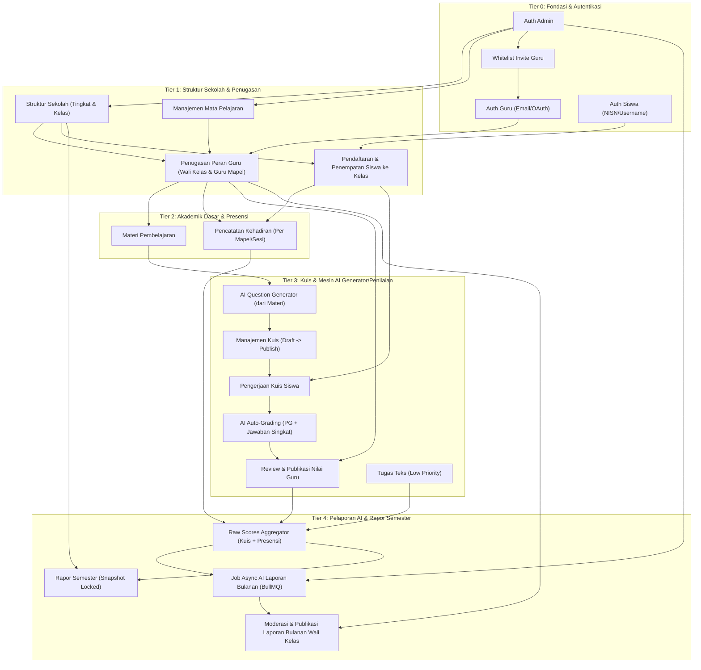

# 🌳 Eleva LMS - Feature Dependency Tree (Pohon Dependensi Fitur)

Dokumen ini memetakan ketergantungan (*dependency tree*) antar fitur dalam sistem **Eleva LMS** berdasarkan spesifikasi pada [design-id.md](file:///c:/Users/Hp/Documents/projects/kada/capstone/eleva-backend/docs/design-id.md) dan [design.md](file:///c:/Users/Hp/Documents/projects/kada/capstone/eleva-backend/docs/design.md).

Pemetaan ini menjadi panduan urutan pengembangan (*build order*) backend API dan skema database (ERD).

---

## 📊 Diagram Alur Ketergantungan (Mermaid DAG)

---

## 🗂️ Rincian Ketergantungan Per Layer (Tier Breakdown)

### 🔹 Tier 0: Fondasi & Autentikasi (Base Level)
Layer ini tidak memiliki dependensi lain dan harus dibangun paling awal.

| Fitur | Prasyarat (Dependencies) | Fitur yang Bergantung Padanya |
| :--- | :--- | :--- |
| **Auth Admin** | Tidak Ada | Manajemen Sekolah, Whitelist Guru, Job Trigger AI |
| **Whitelist Invite Guru** | Auth Admin | Registrasi/Auth Guru |
| **Auth Guru** | Whitelist Email | Penugasan Peran, Manajemen Kuis, Presensi |
| **Auth Siswa** | Di-generate Admin | Login Siswa, Pengerjaan Kuis, Lihat Nilai |

---

### 🔹 Tier 1: Struktur Sekolah & Penugasan
Memetakan hubungan hirarki sekolah di Indonesia.

| Fitur | Prasyarat (Dependencies) | Fitur yang Bergantung Padanya |
| :--- | :--- | :--- |
| **Struktur Kelas** | Auth Admin | Penugasan Wali Kelas, Penempatan Siswa |
| **Manajemen Mapel** | Auth Admin | Penugasan Guru Mapel, Kuis, Materi |
| **Penugasan Peran Guru** | Auth Guru, Kelas, Mapel | Pembuatan Materi, Kuis, Presensi, Review Nilai |
| **Penempatan Siswa** | Auth Siswa, Kelas | Presensi, Pengerjaan Kuis, Laporan Bulanan |

---

### 🔹 Tier 2: Akademik Dasar & Presensi
Input kegiatan belajar mengajar harian.

| Fitur | Prasyarat (Dependencies) | Fitur yang Bergantung Padanya |
| :--- | :--- | :--- |
| **Materi Pembelajaran** | Guru Mapel | AI Question Generator |
| **Pencatatan Kehadiran** | Guru Mapel, Siswa di Kelas | Raw Scores, Laporan Kemajuan AI |

---

### 🔹 Tier 3: Kuis & Mesin AI Auto-Grading
Sistem asesmen berbasis AI dengan persetujuan guru (*Human-in-the-Loop*).

| Fitur | Prasyarat (Dependencies) | Fitur yang Bergantung Padanya |
| :--- | :--- | :--- |
| **AI Question Generator** | Materi Pembelajaran | Draft Soal Kuis (PG & Jawaban Singkat) |
| **Manajemen Kuis** | Guru Mapel, AI Generator | Pengerjaan Kuis Siswa |
| **Pengerjaan Kuis Siswa** | Siswa, Kuis Terbit | AI Auto-Grading Engine |
| **AI Auto-Grading** | Jawaban Siswa | Review & Modifikasi Nilai oleh Guru |
| **Review & Publish Nilai** | Guru Mapel, AI Grading | Raw Scores (Single Source of Truth) |

---

### 🔹 Tier 4: Pelaporan AI & Rapor Semester
Layer teratas yang mengagregasi data dari seluruh kegiatan akademik.

| Fitur | Prasyarat (Dependencies) | Fitur yang Bergantung Padanya |
| :--- | :--- | :--- |
| **Raw Scores Aggregator** | Nilai Kuis Terbit, Presensi | Job AI Laporan Bulanan, Rapor Semester |
| **Job Async AI Laporan Bulanan** | Raw Scores, Admin Trigger (BullMQ) | Draft Laporan Kemajuan Bulanan |
| **Moderasi Laporan Bulanan** | Wali Kelas, Draft AI | Laporan Bulanan Siswa (Published) |
| **Rapor Semester** | Raw Scores Sumatif, Bobot Sekolah | Rapor Cetak / Locked Snapshot |

---

## 🎯 Rekomendasi Urutan Eksekusi Backend (Build Order)

Untuk meminimalkan *blocker* saat *coding*, ikuti urutan pengembangan berikut:

1. **Phase 1 (Core Foundations)**:
   - Module `auth` (Admin, Guru invite/whitelist, Siswa NISN/Username).
   - Module `school` (Classes, Grade Levels, Subjects).
   - Module `users` (Teacher & Student profile management).

2. **Phase 2 (Academic & Attendance)**:
   - Module `materials` (Upload/create learning materials).
   - Module `attendance` (Per-session attendance logging).

3. **Phase 3 (Quiz & AI Engine)**:
   - Module `ai-generator` (Integration with Gemini API using Zod Structured Output).
   - Module `quizzes` & `submissions` (Quiz lifecycle & student submission).
   - Module `grading` (AI evaluation + teacher approval & publication flow).

4. **Phase 4 (Reporting & Async Queue)**:
   - Module `queue` (BullMQ setup for background AI progress report generation).
   - Module `reports` (Monthly Progress Report moderation & Semester Report Card snapshot).
