# 🗃️ Eleva LMS - Entity Relationship Diagram (ERD)

Dokumen ini mendefinisikan skema database PostgreSQL untuk **Eleva LMS**, berdasarkan spesifikasi pada [design.md](file:///c:/Users/Hp/Documents/projects/kada/capstone/eleva-backend/docs/design.md), [deps_tree.md](file:///c:/Users/Hp/Documents/projects/kada/capstone/eleva-backend/docs/deps_tree.md), dan [user_flow.md](file:///c:/Users/Hp/Documents/projects/kada/capstone/eleva-backend/docs/user_flow.md).

---

## 📊 ERD Diagram

```mermaid
erDiagram
    users {
        uuid id PK
        varchar role "ADMIN | TEACHER | STUDENT"
        varchar name
        varchar email UK "nullable (siswa tanpa email)"
        varchar username UK "auto-generated untuk siswa"
        varchar nisn UK "nullable (hanya siswa)"
        varchar password_hash
        varchar google_id UK "nullable (OAuth)"
        boolean is_active "default true"
        timestamptz created_at
        timestamptz updated_at
    }

    teacher_invitations {
        uuid id PK
        varchar email UK
        uuid invited_by FK "users.id (admin)"
        timestamptz accepted_at "nullable"
        timestamptz created_at
    }

    grade_levels {
        uuid id PK
        varchar name "e.g. Kelas 7, Kelas 8"
        integer level_order "untuk sorting"
        timestamptz created_at
        timestamptz updated_at
    }

    classes {
        uuid id PK
        uuid grade_level_id FK
        varchar name "e.g. 7A, 7B"
        uuid homeroom_teacher_id FK "users.id (nullable)"
        timestamptz created_at
        timestamptz updated_at
    }

    subjects {
        uuid id PK
        varchar name "e.g. Matematika"
        varchar code UK "e.g. MAT, IPA"
        text description "nullable"
        timestamptz created_at
        timestamptz updated_at
    }

    teacher_subject_assignments {
        uuid id PK
        uuid teacher_id FK "users.id"
        uuid subject_id FK "subjects.id"
        uuid class_id FK "classes.id"
        timestamptz created_at
    }

    student_enrollments {
        uuid id PK
        uuid student_id FK "users.id"
        uuid class_id FK "classes.id"
        timestamptz enrolled_at
        timestamptz created_at
    }

    materials {
        uuid id PK
        uuid teacher_id FK
        uuid subject_id FK
        uuid class_id FK
        varchar title
        text content
        timestamptz created_at
        timestamptz updated_at
    }

    quizzes {
        uuid id PK
        uuid teacher_id FK
        uuid subject_id FK
        uuid class_id FK
        varchar title
        text description "nullable"
        boolean is_published "default false"
        timestamptz published_at "nullable"
        timestamptz created_at
        timestamptz updated_at
    }

    quiz_questions {
        uuid id PK
        uuid quiz_id FK
        varchar question_type "MULTIPLE_CHOICE | SHORT_ANSWER"
        text question_text
        jsonb options "MC options array"
        text correct_answer "referensi jawaban benar"
        integer points "default 1"
        integer order_number
        timestamptz created_at
    }

    quiz_submissions {
        uuid id PK
        uuid quiz_id FK
        uuid student_id FK
        varchar status "NOT_STARTED -> ... -> PUBLISHED"
        numeric total_score "nullable"
        timestamptz submitted_at "nullable"
        timestamptz graded_at "nullable"
        timestamptz published_at "nullable"
        timestamptz created_at
        timestamptz updated_at
    }

    quiz_answers {
        uuid id PK
        uuid submission_id FK
        uuid question_id FK
        text student_answer
        boolean is_correct "nullable"
        numeric score "nullable"
        numeric ai_score "nullable"
        text ai_feedback "nullable"
        text teacher_feedback "nullable"
        timestamptz created_at
        timestamptz updated_at
    }

    attendance_sessions {
        uuid id PK
        uuid teacher_id FK
        uuid subject_id FK
        uuid class_id FK
        date session_date
        timestamptz created_at
    }

    attendance_records {
        uuid id PK
        uuid session_id FK
        uuid student_id FK
        varchar status "PRESENT | SICK | PERMITTED | ABSENT"
        text note "nullable"
        timestamptz created_at
        timestamptz updated_at
    }

    monthly_reports {
        uuid id PK
        uuid student_id FK
        uuid class_id FK
        integer month "1-12"
        integer year "e.g. 2026"
        varchar status "DRAFT | UNDER_REVIEW | PUBLISHED"
        text ai_summary "nullable"
        jsonb ai_recommendations "nullable"
        text teacher_notes "nullable"
        uuid reviewed_by FK "users.id (wali kelas)"
        timestamptz published_at "nullable"
        timestamptz created_at
        timestamptz updated_at
    }

    semester_reports {
        uuid id PK
        uuid student_id FK
        uuid class_id FK
        integer semester "1 atau 2"
        integer year
        boolean is_locked "default false"
        jsonb report_data "snapshot semua nilai"
        timestamptz locked_at "nullable"
        uuid locked_by FK "users.id (wali kelas)"
        timestamptz created_at
        timestamptz updated_at
    }

    %% === RELATIONSHIPS ===

    users ||--o{ teacher_invitations : "Admin invites"
    users ||--o{ teacher_subject_assignments : "teaches"
    users ||--o{ student_enrollments : "enrolled in"
    users ||--o| classes : "homeroom teacher of"

    grade_levels ||--o{ classes : "contains"
    classes ||--o{ teacher_subject_assignments : "has teachers"
    classes ||--o{ student_enrollments : "has students"
    subjects ||--o{ teacher_subject_assignments : "assigned to"

    users ||--o{ materials : "creates"
    subjects ||--o{ materials : "belongs to"
    classes ||--o{ materials : "for class"

    users ||--o{ quizzes : "creates"
    subjects ||--o{ quizzes : "belongs to"
    classes ||--o{ quizzes : "for class"
    quizzes ||--o{ quiz_questions : "has"

    quizzes ||--o{ quiz_submissions : "attempted by"
    users ||--o{ quiz_submissions : "submits"
    quiz_submissions ||--o{ quiz_answers : "contains"
    quiz_questions ||--o{ quiz_answers : "answered in"

    users ||--o{ attendance_sessions : "records"
    subjects ||--o{ attendance_sessions : "for subject"
    classes ||--o{ attendance_sessions : "for class"
    attendance_sessions ||--o{ attendance_records : "has"
    users ||--o{ attendance_records : "attendance of"

    users ||--o{ monthly_reports : "report for"
    classes ||--o{ monthly_reports : "in class"

    users ||--o{ semester_reports : "report for"
    classes ||--o{ semester_reports : "in class"
```

---

## 📋 Daftar Tabel & Deskripsi

| # | Tabel | Deskripsi | Relasi Utama |
| :--- | :--- | :--- | :--- |
| 1 | `users` | Semua pengguna (Admin, Guru, Siswa) dalam satu tabel | Sentral |
| 2 | `teacher_invitations` | Whitelist email undangan guru oleh Admin | `users` (invited_by) |
| 3 | `grade_levels` | Tingkat kelas (Kelas 7, 8, 9, dst.) | Parent of `classes` |
| 4 | `classes` | Kelas spesifik (7A, 7B, dst.) | `grade_levels`, `users` (homeroom) |
| 5 | `subjects` | Mata pelajaran (Matematika, IPA, dst.) | Referenced by assignments |
| 6 | `teacher_subject_assignments` | Junction: Guru ↔ Mapel ↔ Kelas | `users`, `subjects`, `classes` |
| 7 | `student_enrollments` | Junction: Siswa ↔ Kelas | `users`, `classes` |
| 8 | `materials` | Materi pembelajaran | `users`, `subjects`, `classes` |
| 9 | `quizzes` | Kuis (draft atau published) | `users`, `subjects`, `classes` |
| 10 | `quiz_questions` | Soal kuis (PG / Jawaban Singkat) | `quizzes` |
| 11 | `quiz_submissions` | Pengerjaan kuis siswa + status state machine | `quizzes`, `users` |
| 12 | `quiz_answers` | Jawaban per soal + skor AI + feedback | `quiz_submissions`, `quiz_questions` |
| 13 | `attendance_sessions` | Sesi presensi (per mapel per kelas per tanggal) | `users`, `subjects`, `classes` |
| 14 | `attendance_records` | Rekaman kehadiran per siswa per sesi | `attendance_sessions`, `users` |
| 15 | `monthly_reports` | Laporan kemajuan bulanan (AI-generated) | `users`, `classes` |
| 16 | `semester_reports` | Rapor semester (snapshot locked) | `users`, `classes` |

---

## 🔑 Enum & Status Constants (Sesuai design.md)

| Enum Name | Values | Digunakan Di |
| :--- | :--- | :--- |
| `user_role` | `ADMIN`, `TEACHER`, `STUDENT` | `users.role` |
| `question_type` | `MULTIPLE_CHOICE`, `SHORT_ANSWER` | `quiz_questions.question_type` |
| `quiz_submission_status` | `NOT_STARTED`, `IN_PROGRESS`, `SUBMITTED`, `GRADING_PENDING`, `GRADED`, `PUBLISHED` | `quiz_submissions.status` |
| `attendance_status` | `PRESENT`, `SICK`, `PERMITTED`, `ABSENT` | `attendance_records.status` |
| `report_status` | `DRAFT`, `UNDER_REVIEW`, `PUBLISHED` | `monthly_reports.status` |

---

## 🏗️ Design Decisions

1. **Single `users` Table**: Admin, Guru, dan Siswa disimpan dalam satu tabel dengan kolom `role`. Ini menyederhanakan autentikasi dan foreign key references.

2. **Homeroom Teacher di `classes`**: Kolom `homeroom_teacher_id` langsung pada tabel `classes` karena satu kelas hanya memiliki satu wali kelas.

3. **Subject Teacher di Junction Table**: `teacher_subject_assignments` memetakan guru ↔ mapel ↔ kelas (many-to-many-to-many).

4. **Attendance Per Session**: `attendance_sessions` merepresentasikan satu sesi mengajar (guru + mapel + kelas + tanggal), `attendance_records` berisi status per siswa per sesi.

5. **JSONB untuk Data Dinamis AI**: Kolom `options` (soal PG), `ai_recommendations` (rekomendasi AI), dan `report_data` (snapshot rapor) menggunakan JSONB untuk fleksibilitas tanpa perlu tabel tambahan.

6. **Semester Reports sebagai Snapshot**: `report_data` (JSONB) menyimpan snapshot lengkap semua nilai saat rapor di-finalize, sehingga data historis terjaga meski nilai mentah berubah.
