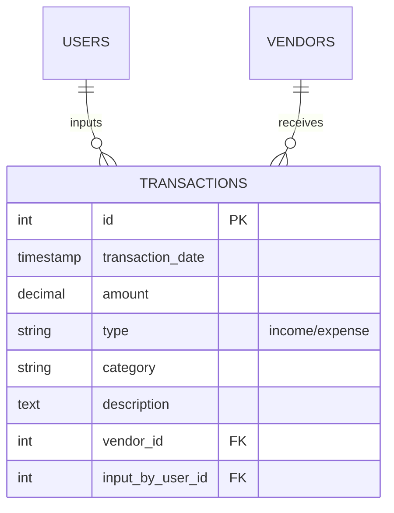
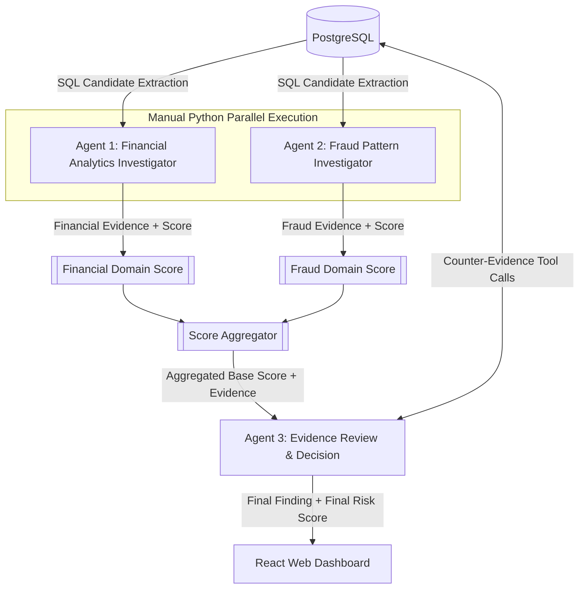

# Proposal Proyek: AI Financial Analyst (Sistem Multi-Agen Berbasis PostgreSQL)

## 1. Ringkasan Eksekutif
Aplikasi ini bertindak sebagai **Proactive AI Financial Analyst** yang mengaudit transaksi keuangan perusahaan secara otonom. Menggunakan arsitektur *Multi-Agent Orchestration* dengan paradigma **Agent = LLM + Tools**, sistem ini membagi peran menjadi Investigator, Reviewer, dan Synthesizer.

> **Pembeda Utama Arsitektur Ini:**
> Alih-alih mengirim seluruh raw data transaksi ke LLM (yang sangat lambat dan memakan biaya token besar), sistem ini **terlebih dahulu mengekstraksi kandidat temuan menggunakan SQL dan analisis statistik**. LLM kemudian berfokus penuh pada *reasoning* (penalaran), pengumpulan *evidence* (bukti) tambahan melalui *tool calling*, serta penyusunan *insight* bisnis yang transparan dan dapat dijelaskan (*explainable*).
>
> Pendekatan ini menjawab tantangan performa, efisiensi biaya API, dan memastikan LLM tidak menggantikan fungsi komputasi database, melainkan menjadi **reasoning layer** di atasnya.

---

## 2. Arsitektur & Teknologi Minimum Viable Product (MVP)
Berdasarkan evaluasi kebutuhan, arsitektur teknis MVP dirancang sebagai berikut:

*   **Frontend (User Interface):** Aplikasi Web Dashboard berbasis **React (Vite untuk UI sementara; Next.js opsional untuk fase produk)**. Digunakan oleh **tim finance** untuk meninjau temuan, melihat jejak audit (provenance), dan membaca executive summary.
*   **Backend & Orchestration:** **FastAPI (Python)** sebagai API server. Pada MVP awal, orkestrasi multi-agen dijalankan secara eksplisit di backend menggunakan Python concurrency (`ThreadPoolExecutor`) agar Agent 1 dan Agent 2 bisa berjalan paralel. **LangGraph** diposisikan sebagai opsi fase berikutnya jika workflow membutuhkan state machine, retry per-node, persistence, dan observability yang lebih kuat.
*   **Database Operasional:** **PostgreSQL**. Dipilih karena dukungan fungsi agregasi analitik SQL yang kuat dan kapabilitas `JSONB` untuk melacak status antar-agen.
*   **Penyedia LLM:** Menggunakan penyedia LLM tunggal yang bertenaga, yaitu **Gemini API**, untuk memberikan stabilitas dan performa penalaran pada semua agen MVP.
*   **Data Seeding:** Skrip Python menggunakan **Faker & SQLAlchemy** akan mengisi database dengan data transaksi tiruan, serta menyuntikkan anomali terencana (seperti duplikasi transaksi atau lonjakan biaya) untuk keperluan *testing*. Dashboard menampilkan final finding setelah seluruh pipeline selesai; detail hasil tiap agent dapat dibuka dari node Agent 1, Agent 2, atau Agent 3 pada visualisasi pipeline.

---

## 3. Skema Data & Provenance (*Shared State*)

### Entity-Relationship Diagram (ERD) & Skema Tabel (Fokus: `transactions`)


### Skema Tabel SQL
```sql
CREATE TABLE users (
    id SERIAL PRIMARY KEY,
    email VARCHAR(255) UNIQUE NOT NULL,      -- identitas login
    fullname VARCHAR(100) NOT NULL,
    password_hash VARCHAR(255),              -- NULL = akun Google-only
    google_sub VARCHAR(255) UNIQUE,
    is_admin BOOLEAN NOT NULL DEFAULT false, -- true = Finance Lead
    must_change_password BOOLEAN NOT NULL DEFAULT false,
    is_active BOOLEAN NOT NULL DEFAULT true,
    last_login_at TIMESTAMPTZ,
    created_at TIMESTAMPTZ NOT NULL DEFAULT now(),
    updated_at TIMESTAMPTZ
);

CREATE TABLE vendors (
    id SERIAL PRIMARY KEY,
    vendor_name VARCHAR(100) NOT NULL,
    bank_account VARCHAR(50) NOT NULL,
    join_date TIMESTAMP DEFAULT CURRENT_TIMESTAMP,
    status VARCHAR(20) DEFAULT 'active'
);

CREATE TABLE transactions (
    id SERIAL PRIMARY KEY,
    transaction_date TIMESTAMP NOT NULL,
    amount DECIMAL(15,2) NOT NULL,
    type VARCHAR(10) NOT NULL, -- 'income' atau 'expense'
    category VARCHAR(50) NOT NULL,
    description TEXT,
    vendor_id INT REFERENCES vendors(id),
    input_by_user_id INT REFERENCES users(id)
);
```

### Pengguna Sistem
Aplikasi ini dipakai **khusus oleh tim finance**. Tidak ada role-based access control: `is_admin` adalah satu-satunya pembeda hak akses, dan ia hanya menjaga endpoint manajemen user.

| Tipe | Flag | Akses |
| :--- | :--- | :--- |
| **Finance Staff** | `is_admin = false` | Seluruh fitur transaksi, vendor, dan temuan |
| **Finance Lead** | `is_admin = true` | Sama persis + mengelola akun anggota tim |

Semua anggota tim melihat data yang sama persis — tidak ada penyaringan per orang maupun per departemen. Tidak ada registrasi mandiri; akun hanya dibuat oleh Finance Lead. Detail lengkap ada di `auth_user_technical.md` (teknis) dan `auth_user_overview.md` (non-teknis).

### Skema Komunikasi (*State JSON*)
Agen mentransmisikan status beserta **Provenance** (jejak data), memisahkan **Evidence** (Objektif vs Semantik), dan melampirkan **Scoring**.

```json
{
  "finding": "Expense Spike & Possible Splitting",
  "provenance": {
      "generated_by": "Agent_1_Financial_Analytics",
      "tools_used": ["calculate_z_score", "get_sales_trend"],
      "sql_reference": ["transactions", "vendors"]
  },
  "evidence": {
      "objective": [
          {"metric": "expense_spike_zscore", "value": 4.5},
          {"metric": "sales_trend", "value": "Stagnant (0.5% growth)"}
      ],
      "semantic": [
          {"source": "description", "insight": "Klaim 'demand tinggi' bertentangan dengan data sales_trend"}
      ]
  },
  "scoring": {
      "base_risk_score": 60,
      "objective_triggers": ["Z-Score 4.5 (+30)", "New Vendor (+30)"],
      "llm_semantic_adjustment": 15,
      "adjustment_reason": "Deskripsi mencurigakan, nominal besar namun tanpa justifikasi rinci.",
      "final_risk_score": 75,
      "risk_level": "High Risk",
      "recommendation": "Need Manual Review & Approval Check"
  },
  "status": "pending_review"
}
```

---

## 4. Arsitektur Agen dan Alur Orkestrasi MVP (FastAPI Manual Orchestration)

### Bagan Alir (Flowchart)
Pada MVP awal, orkestrasi dijalankan langsung di backend FastAPI. Agen 1 dan Agen 2 dieksekusi secara **paralel** menggunakan Python concurrency. Masing-masing agent menghasilkan evidence domain dan skor domain deterministik. Hasil keduanya digabungkan oleh **Scoring Aggregator**, lalu Agent 3 melakukan review akhir, mencari counter-evidence, dan memberi penyesuaian semantik.



### Rincian Tugas Agen
1. **Agent 1: Financial Analytics Investigator**: Mengumpulkan evidence finansial seperti Z-score, timing transaksi, histori vendor, dan menghasilkan skor domain finansial berbasis rule deterministik.
2. **Agent 2: Fraud Pattern Investigator**: Mengumpulkan evidence fraud seperti split payment, transaksi duplikat, dan status vendor, lalu menghasilkan skor domain fraud berbasis rule deterministik.
3. **Scoring Aggregator**: Menggabungkan skor Agent 1 dan Agent 2 menjadi `base_risk_score` global dengan batas maksimum sesuai risk policy MVP.
4. **Agent 3: Evidence Review & Decision**: Mereview hasil Agent 1 dan Agent 2, mencari counter-evidence melalui tool, lalu memberi `llm_semantic_adjustment` untuk menghasilkan skor final.
5. **Executive Insight Synthesizer**: Opsional untuk fase berikutnya. Pada MVP awal, final narrative dapat langsung berasal dari Agent 3.

### Pola Tampilan Dashboard
Dashboard utama menampilkan **final finding** setelah melewati seluruh pipeline. Visualisasi node tetap dipakai untuk provenance: ketika user mengklik node Agent 1, Agent 2, atau Agent 3, dashboard membuka modal berisi hasil agent tersebut, termasuk finding, evidence, tools used, dan skor domain/review.

---

## 5. Katalog Alat (Tool Catalog)

| Nama Tool | Pengguna | Fungsi Utama |
| :--- | :--- | :--- |
| `calculate_z_score()` | Agent 1 | Menghitung anomali statistik / lonjakan ekstrem via SQL |
| `get_sales_trend()` | Agent 1, 3 | Verifikasi kebenaran klaim permintaan / sales via SQL |
| `get_budget_variance()`| Agent 1 | Membandingkan pengeluaran terhadap pagu budget |
| `find_duplicate_expenses()`| Agent 2 | Mencari transaksi ganda / indikasi split payment |
| `get_vendor_history()` | Agent 2, 3 | Memeriksa umur vendor dan histori transaksi |

---

## 6. Penjelasan Konsep: Hybrid Risk Scoring

Sistem ini mencegah fenomena **Black-Box AI** dengan tidak menyerahkan sepenuhnya perhitungan skor pada LLM. Penilaian risiko merupakan gabungan antara metrik pasti (Deterministik) dan intuisi teks (Semantik).

### 6A. Base Risk Score (Deterministik oleh `Scoring Engine` Python)
Skor awal dihitung otomatis tanpa campur tangan LLM berdasarkan bukti objektif. (Maksimal Base Score: 80)

| Pemicu (Trigger)        | Kondisi                                 | Poin Risiko (+/-) |
| :------------------------| :----------------------------------------| :------------------|
| **Z-Score Anomaly**     | 3.0 ≤ Z-Score ≤ 4.0                 | + 20              |
|                         | 4.1 ≤ Z-Score ≤ 5.0                 | + 30              |
|                         | Z-Score > 5.0                           | + 40              |
| **Pola Transaksi**      | Transaksi Ganda (Nominal Sama < 24 jam) | + 40              |
|                         | Transaksi di luar jam kerja (Midnight)  | + 20              |
| **Kredibilitas Vendor** | Vendor Baru (Belum ada histori)         | + 30              |
| **Kepatuhan Anggaran**  | Melewati varians budget (Overbudget)    | + 10 ekstra       |

### 6B. LLM Semantic Adjustment (Evaluasi oleh Agent 3)
LLM menyesuaikan skor di atas berdasarkan pemahaman kontekstual dan analisis deskripsi transaksi.

| Kategori Evaluasi LLM | Penjelasan | Poin Penyesuaian |


| :--- | :--- | :--- |
| **Strong Justification** | Deskripsi sangat rasional dan sejalan dengan kondisi bisnis aktual (misal pelunasan kontrak terstruktur). | -15 hingga -20 |
| **Weak Justification** | Deskripsi masuk akal namun terlalu umum (misal sekadar "Pembelian barang operasional"). | -1 hingga -10 |
| **Neutral** | Deskripsi standar, tidak mencurigakan, tetapi tidak cukup untuk membersihkan risiko sepenuhnya. | 0 |
| **High Suspicion** | Deskripsi mencurigakan (hanya tulisan "Lain-lain", tidak nyambung dengan nominal). | +10 hingga +20 |

### 6C. Matriks Keputusan Final (Final Risk Score)
`Final Risk Score = Base Risk Score + LLM Semantic Adjustment`

| Rentang Skor (Final) | Tingkat Risiko | Rekomendasi Sistem |
| :--- | :--- | :--- |
| **0 - 39** | **Low Risk** | Transaksi wajar. Otomatis disetujui (No Action). |
| **40 - 59** | **Medium Risk** | Anomali ringan. Dicatat ke dalam audit report bulanan. |
| **60 - 79** | **High Risk** | Indikasi kecurangan. Butuh verifikasi manual (Manual Review). |
| **80 - 100** | **Critical Risk** | Indikasi fraud fatal. Eskalasi darurat ke Finance Lead. |

---

## 7. FAQ: Justifikasi Keputusan Arsitektur MVP

**Q: Mengapa menggunakan antarmuka Web Dashboard (React/Next.js) ketimbang API biasa atau pengiriman Email otomatis?**
A: Audit finansial membutuhkan visualisasi data dan penjelasan (*explainability*). Web dashboard memungkinkan tim finance untuk menelusuri rantai pemikiran agen (*provenance*), mengklik bukti pendukung, dan menyetujui atau menolak temuan AI secara interaktif.

**Q: Mengapa MVP memakai FastAPI dengan manual orchestration, bukan langsung LangGraph?**
A: FastAPI cukup untuk MVP karena workflow masih linear: SQL extraction, Agent 1 dan Agent 2 paralel, scoring aggregator, lalu Agent 3 review. Manual orchestration lebih cepat dibangun dan lebih mudah dijelaskan untuk demo. LangGraph tetap relevan sebagai fase berikutnya jika sistem membutuhkan state machine eksplisit, retry per-node, checkpointing, human-in-the-loop, atau observability workflow yang lebih kuat.

**Q: Mengapa PostgreSQL dan bukan database lain (misalnya MySQL atau MongoDB)?**
A: PostgreSQL menawarkan dukungan agregasi statistik (berguna untuk pencarian Z-score bawaan) yang jauh lebih superior dibandingkan database NoSQL. Selain itu, fitur `JSONB` yang kuat di PostgreSQL dapat membantu menyimpan provenance, audit trail, dan status pipeline tanpa perlu merusak skema relasional tabel operasional.

**Q: Mengapa memakai penyedia LLM tunggal (Gemini API) padahal sebelumnya direncanakan menggunakan LLM beragam (Mistral, Llama)?**
A: Pada fase MVP, menggunakan penyedia LLM tunggal menekan kompleksitas infrastruktur, masalah latensi asinkron (*rate limits*, stabilitas server), serta menyederhanakan konfigurasi token. API modern (seperti Gemini 1.5 Pro) telah memiliki kemampuan *reasoning* dan *tool-calling* komprehensif yang mumpuni menjalankan tugas 4 agen tersebut sekaligus.

**Q: Mengapa perhitungan Base Score ditarik ke dalam modul Python `Scoring Engine` dan bukan diserahkan ke agen LLM (Agent 3)?**
A: Untuk mencegah halusinasi matematis (Black-box AI). LLM dirancang untuk penalaran berbasis teks, namun rentan dalam menghasilkan perhitungan aritmatika konsisten. Menghitung Base Score di Python secara deterministik menjamin kepatuhan sistem (misal duplikasi pasti dihitung +40), sementara LLM (Agent 3) hanya bertugas menyesuaikan skor secara semantik sesuai dengan konteks percakapan.

**Q: Kenapa mengeksekusi Agent 1 dan Agent 2 secara paralel?**
A: Karena Agent 1 (Analitik Kuantitatif) dan Agent 2 (Investigator Penipuan Pola) tidak saling membutuhkan data awal satu sama lain, mereka dapat mengeksekusi *tool* SQL secara independen. Mengeksekusi secara berurutan akan melipatgandakan waktu respon, sedangkan eksekusi paralel melalui Python concurrency cukup untuk kebutuhan MVP awal.

**Q: Darimana dasar penetapan bobot poin pada Scoring AI (misalnya Z-score > 5.0 bernilai +40 poin)?**
A: Dasar scoring ini diadaptasi dari praktik terbaik audit forensik dan kerangka manajemen risiko keuangan (seperti COSO Framework dan ACFE - Association of Certified Fraud Examiners). Pembobotan bersifat heuristik pada versi MVP dan nantinya dikonfigurasi bersama Finance Lead selaku pemilik kebijakan risiko. Nilai tinggi (seperti +40 poin, setara setengah batas kritis) diberikan pada indikator penipuan mutlak seperti transaksi ganda. Sistem ini dirancang secara modular agar perusahaan dapat menyesuaikan (tuning) batas *risk appetite* mereka kapan saja di dalam modul `Scoring Engine`.

**Q: Bagaimana pertanggungjawaban AI atas temuannya? Apakah hasil evaluasinya dapat dijustifikasi secara audit?**
A: Sangat bisa dijustifikasi. Aplikasi ini dibangun dengan prinsip *Explainable AI* (XAI). Setiap temuan yang dihasilkan tidak berupa tebakan acak (*black-box*), melainkan secara otomatis melampirkan objek **Provenance** (jejak asal usul data). Objek ini berisi log audit lengkap: *tools* Python apa saja yang dijalankan AI, baris data atau kueri SQL persis apa yang dieksekusi ke *database* (`sql_reference`), serta metrik kuantitatif pasti yang mendasarinya (seperti nilai aktual Z-Score). Melalui arsitektur ini, anggota tim finance dapat menelusuri mundur setiap langkah logika AI—dari kesimpulan akhir hingga ke data transaksi mentah asalnya—memastikan akuntabilitas penuh atas setiap temuan.

**Q: Apakah Agent 3 dapat mencari *counter-evidence* (bukti bantahan) terhadap temuan Agent 1 dan Agent 2?**
A: Betul. Agent 3 bertindak sebagai lapis pertahanan kedua (*quality control*) dengan pendekatan *adversarial*. Jika Agent 1 atau 2 melaporkan indikasi fraud, Agent 3 tidak serta merta mempercayainya. Agent 3 diprogram untuk melakukan "Challenge", yaitu secara aktif mencari *counter-evidence* atau fakta yang melegitimasi transaksi tersebut. Contohnya, jika Agent 1 curiga karena ada "Expense Spike", Agent 3 dapat memanggil *tool* `get_sales_trend()` untuk mengecek apakah lonjakan pengeluaran tersebut sebanding dengan peningkatan *sales* (penjualan). Jika terbukti berbanding lurus, Agent 3 akan memberikan penyesuaian skor negatif (*Semantic Adjustment* minus) guna menurunkan tingkat risiko dan mencegah *false positive* (alarm palsu).