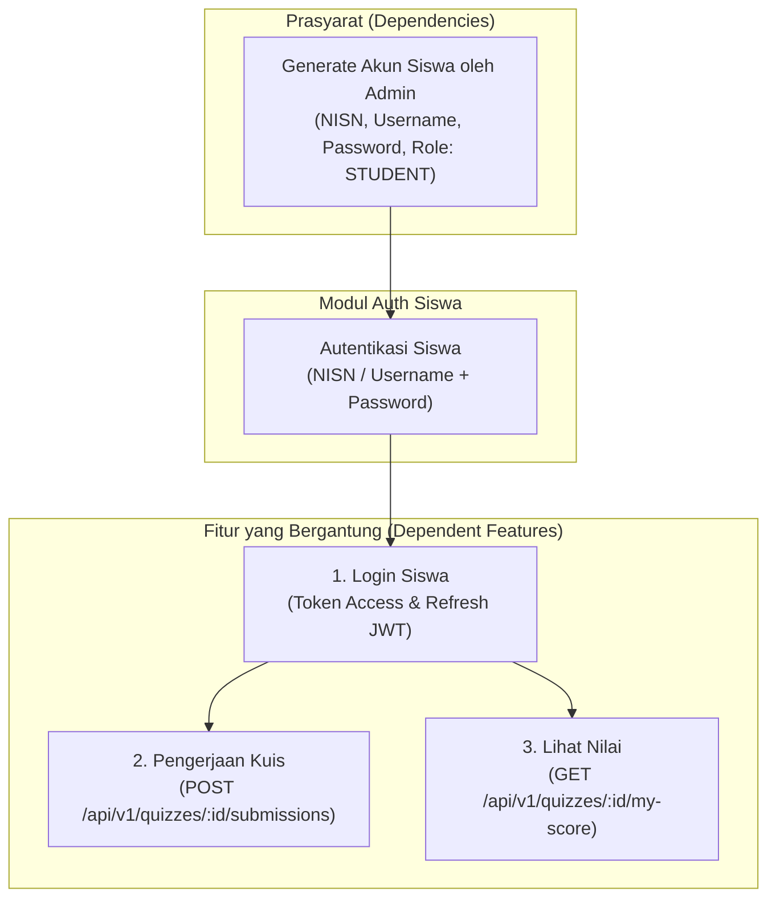
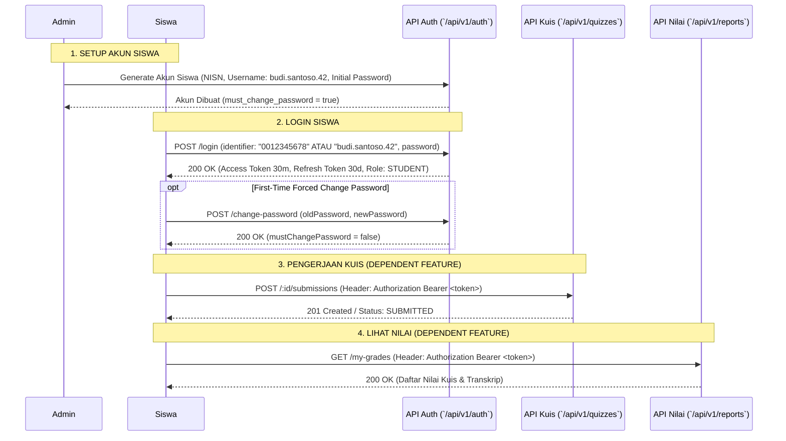

# 🎓 Technical Documentation - Autentikasi & Otorisasi Siswa (Auth Siswa)

Dokumen teknikal ini menjelaskan arsitektur, alur kerja, spesifikasi API, dan skema validasi khusus untuk modul **Autentikasi & Otorisasi Siswa (Auth Siswa)** pada sistem **Eleva LMS**.

---

## 📌 Ringkasan & Arsitektur Modul

Modul **Auth Siswa** mengelola proses autentikasi dan otorisasi pengguna dengan peran `STUDENT`. Modul ini dirancang dengan prinsip **Pure Admin Invitation & Account Generation** di mana akun siswa tidak dibuat secara mandiri (tidak ada *self-registration*), melainkan sepenuhnya dibuat dan dikelola oleh Administrator Sekolah.

### 🔑 Pilihan Identifikasi Login (Login Options)
Akun siswa mendukung fleksibilitas autentikasi melalui satu endpoint terpadu (`POST /api/v1/auth/login`) menggunakan kombinasi berikut:
1. **NISN (National Student ID)**: Nomor Induk Siswa Nasional (contoh: `0012345678`).
2. **System-Generated Username**: Username unik yang dihasilkan otomatis oleh sistem saat pendaftaran siswa oleh Admin (kombinasi nama + nomor unik, contoh: `budi.santoso.42`).
3. **Password**: Password akun siswa (password awal dibuat oleh Admin, diwajibkan ganti password saat login pertama jika flag `must_change_password = true`).

---

## 🔗 Prasyarat & Ketergantungan Fitur (Dependency Tree)



| Fitur | Prasyarat (Dependencies) | Fitur yang Bergantung Padanya |
| :--- | :--- | :--- |
| **Auth Siswa** | Akun di-generate oleh Admin (NISN, Username, Password) | Login Siswa, Pengerjaan Kuis, Lihat Nilai |

---

## 🔄 Alur Interaksi & Otorisasi Siswa (User Flow)



---

## 🗄️ Skema Entitas Database (`users`)

Data siswa disimpan dalam tabel `users` dengan atribut spesifik berikut:

| Kolom | Tipe Data | Constraint | Deskripsi untuk Siswa |
| :--- | :--- | :--- | :--- |
| `id` | `UUID` | `PRIMARY KEY` | Unique Identifier pengguna |
| `role` | `user_role` | `NOT NULL` | Bernilai `'STUDENT'` |
| `name` | `VARCHAR(255)` | `NOT NULL` | Nama lengkap siswa (contoh: `Budi Santoso`) |
| `nisn` | `VARCHAR(20)` | `UNIQUE`, `NULLABLE` | Nomor Induk Siswa Nasional (contoh: `0012345678`) |
| `username` | `VARCHAR(100)` | `UNIQUE`, `NULLABLE` | Username system-generated (contoh: `budi.santoso.42`) |
| `email` | `VARCHAR(255)` | `NULLABLE` | Email opsional bagi siswa |
| `password_hash` | `VARCHAR(255)` | `NOT NULL` | Hash password (bcryptjs, cost factor 10) |
| `must_change_password`| `BOOLEAN` | `NOT NULL`, `DEFAULT TRUE` | Flag wajib ganti password di login awal |
| `is_active` | `BOOLEAN` | `NOT NULL`, `DEFAULT TRUE` | Status keaktifan akun siswa |

---

## 📡 Spesifikasi API Endpoints Auth Siswa

### 1. Login Siswa (`POST /api/v1/auth/login`)
Memverifikasi kredensial siswa menggunakan **NISN** atau **System-Generated Username** beserta **Password**.

- **Access**: Public
- **Validation**: Zod `loginSchema` (`identifier` min 1, `password` min 1)

#### Request Body (Pilihan A: Menggunakan NISN)
```json
{
  "identifier": "0012345678",
  "password": "InitialPassword123!"
}
```

#### Request Body (Pilihan B: Menggunakan Username)
```json
{
  "identifier": "budi.santoso.42",
  "password": "InitialPassword123!"
}
```

#### Successful Response (HTTP 200 OK)
```json
{
  "success": true,
  "message": "Login successful",
  "data": {
    "user": {
      "id": "e9b2c3d4-5678-90ab-cdef-1234567890ab",
      "role": "STUDENT",
      "name": "Budi Santoso",
      "email": null,
      "username": "budi.santoso.42",
      "nisn": "0012345678",
      "googleId": null,
      "isActive": true,
      "mustChangePassword": true,
      "createdAt": "2026-07-31T04:00:00.000Z",
      "updatedAt": "2026-07-31T04:00:00.000Z"
    },
    "mustChangePassword": true,
    "tokens": {
      "accessToken": "eyJhbGciOiJIUzI1NiIsInR5cCI6IkpXVCJ9...",
      "refreshToken": "eyJhbGciOiJIUzI1NiIsInR5cCI6IkpXVCJ9..."
    }
  }
}
```

---

### 2. Ganti Password Siswa (`POST /api/v1/auth/change-password`)
Digunakan oleh siswa saat login pertama atau secara sukarela untuk memperbarui password.

- **Access**: Authenticated (`STUDENT`)
- **Headers**: `Authorization: Bearer <access_token>`

#### Request Body
```json
{
  "oldPassword": "InitialPassword123!",
  "newPassword": "MySecretPassword2026!"
}
```

#### Successful Response (HTTP 200 OK)
```json
{
  "success": true,
  "message": "Password successfully changed. You can now use your new password.",
  "data": {
    "id": "e9b2c3d4-5678-90ab-cdef-1234567890ab",
    "role": "STUDENT",
    "name": "Budi Santoso",
    "username": "budi.santoso.42",
    "nisn": "0012345678",
    "mustChangePassword": false
  }
}
```

---

### 3. Profil Siswa Terautentikasi (`GET /api/v1/auth/me`)
Mengambil data identitas siswa yang sedang login.

- **Access**: Authenticated (`STUDENT`)
- **Headers**: `Authorization: Bearer <access_token>`

#### Successful Response (HTTP 200 OK)
```json
{
  "success": true,
  "message": "Authenticated user profile retrieved",
  "data": {
    "id": "e9b2c3d4-5678-90ab-cdef-1234567890ab",
    "role": "STUDENT",
    "name": "Budi Santoso",
    "email": null,
    "username": "budi.santoso.42",
    "nisn": "0012345678",
    "mustChangePassword": false
  }
}
```

---

## 🔒 Otorisasi Fitur Dependen (Role-Based Access Control)

Setelah berhasil login, token JWT `accessToken` digunakan pada header `Authorization: Bearer <token>` untuk mengakses fitur-fitur dependen siswa:

```javascript
// Example Middleware Authorization Check
export const authorizeRoles = (...allowedRoles) => {
  return (req, res, next) => {
    if (!req.user || !allowedRoles.includes(req.user.role)) {
      return res.status(403).json({
        success: false,
        message: 'Forbidden: Access restricted to students only'
      });
    }
    next();
  };
};
```

1. **Pengerjaan Kuis**:
   - Endpoint: `POST /api/v1/quizzes/:id/submissions`
   - Otorisasi: `authenticate`, `authorizeRoles('STUDENT')`
2. **Lihat Nilai**:
   - Endpoint: `GET /api/v1/quizzes/:id/my-score` / `GET /api/v1/reports/my-grades`
   - Otorisasi: `authenticate`, `authorizeRoles('STUDENT')`
