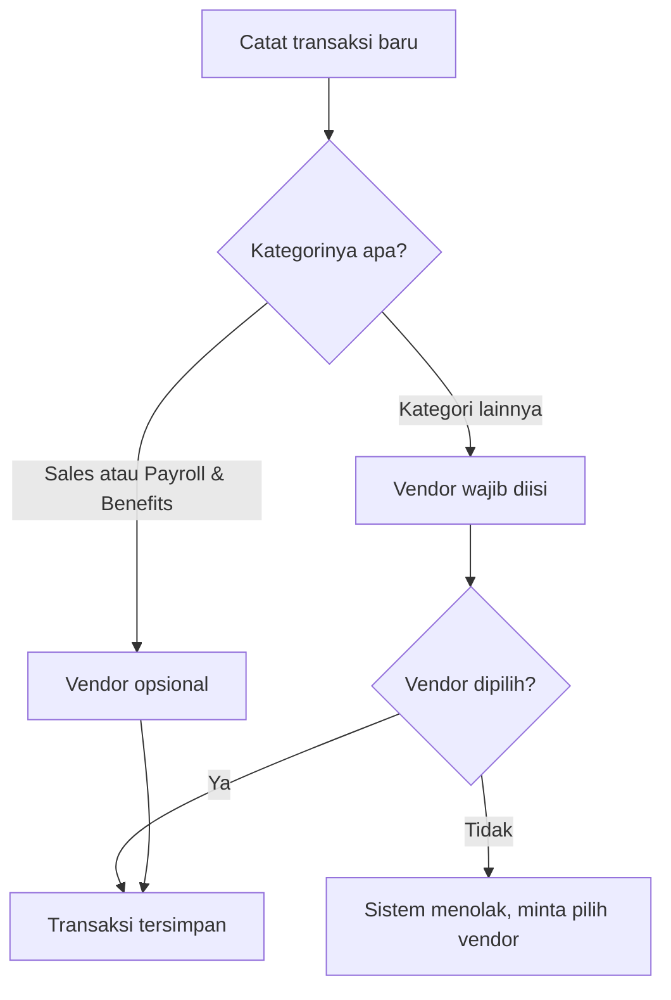

# Transaksi & Vendor — Gambaran Umum

Dokumen ini menjelaskan **bagaimana tim finance mencatat transaksi dan mengelola daftar vendor**, tanpa istilah teknis. Untuk detail implementasi, lihat `transactions_vendor_technical.md`. Untuk siapa yang boleh masuk ke aplikasi, lihat `auth_user_overview.md`.

---

## Apa yang dicatat di sini

Ada dua hal yang saling berkaitan:

- **Transaksi** — setiap uang masuk (income) atau keluar (expense): tanggal, jumlah, kategori, deskripsi, dan (kadang) vendor terkait.
- **Vendor** — daftar pihak luar yang perusahaan bayar atau ditagih: nama dan rekening banknya.

Vendor itu sendiri bukan transaksi — dia semacam "buku alamat" yang transaksi bisa rujuk, supaya tidak perlu mengetik ulang nama dan rekening yang sama setiap kali.

---

## Siapa yang boleh mencatat

**Siapa saja di tim finance** — Finance Staff maupun Finance Lead, tanpa beda hak. Ini konsisten dengan prinsip di `auth_user_overview.md`: satu-satunya perbedaan Finance Lead adalah wewenang mengelola akun tim, bukan wewenang atas data keuangan. Menambah transaksi, mengedit transaksi, mendaftarkan vendor, mengubah status vendor — semuanya bisa dilakukan siapa pun yang sudah login.

> **Yang sengaja tidak ada:** tidak ada persetujuan berjenjang (approval), tidak ada pembatasan "staff hanya boleh input, Lead yang mengedit". Siapa pun mencatat, siapa pun bisa membetulkan.

---

## Kapan vendor wajib diisi

Saat mencatat transaksi, kolom vendor **kadang wajib, kadang opsional** — tergantung kategorinya.

Aturannya sederhana: **kalau transaksi itu punya satu pihak luar yang jelas, vendor-nya wajib diisi.** Hanya dua kategori yang dikecualikan, karena keduanya memang tidak punya satu pihak tunggal yang bisa disebut:

| Kategori | Kenapa tidak butuh vendor |
| :--- | :--- |
| **Sales** | Ini pendapatan ritel/agregat — banyak pembeli kecil, bukan satu pembeli yang bisa dicatat namanya |
| **Payroll & Benefits** | Ini dibayarkan ke karyawan sendiri, bukan ke vendor luar |

Semua kategori lain — termasuk **B2B Sales** (penjualan ke perusahaan lain, walau itu juga "sales") — **wajib** menyebutkan vendornya, karena selalu ada satu pihak spesifik di baliknya: pemasok yang ditagih, atau pembeli korporat yang menerima tagihan.

---

## Siklus hidup vendor

Vendor punya dua status: **Aktif** atau **Nonaktif**. Tidak ada status lain, dan **vendor tidak pernah benar-benar dihapus** — sama seperti akun pengguna, ini demi menjaga jejak audit. Transaksi lama yang menyebut vendor tertentu harus tetap bisa menunjukkan nama vendor itu, walau vendornya sudah lama tidak dipakai lagi.

Efek menonaktifkan vendor:

- Vendor itu **hilang dari pilihan** saat mencatat transaksi baru.
- **Transaksi lama yang sudah memakainya tidak terpengaruh sama sekali** — tetap tampil normal, dan kalau transaksi itu dibuka untuk diedit, vendor yang sama tetap muncul sebagai pilihan (khusus untuk transaksi itu saja).
- Mengaktifkan kembali membuatnya muncul lagi di semua pilihan.

Tidak ada konfirmasi tambahan saat menonaktifkan/mengaktifkan — satu klik langsung berlaku.

---

## Kejadian sehari-hari

**Bayar tagihan listrik bulanan.** Staff mencatat transaksi expense, kategori "Utilities". Karena kategori ini wajib vendor, dia harus memilih vendor "PLN" dari daftar (atau mendaftarkannya dulu kalau belum ada) sebelum bisa menyimpan.

**Mencatat pendapatan harian toko.** Staff mencatat income, kategori "Sales". Tidak ada vendor yang perlu dipilih — memang tidak ada satu pembeli untuk disebut namanya.

**Vendor lama sudah tidak dipakai lagi.** Finance Lead menonaktifkan vendor itu dari daftar. Transaksi-transaksi lama yang pernah mencatatnya tetap utuh dan tetap menampilkan namanya — hanya saja vendor itu tidak akan muncul lagi saat mencatat transaksi baru.

**Salah pilih kategori saat mengedit.** Staff mengedit transaksi "Office Supplies" (butuh vendor) menjadi "Payroll & Benefits" (tidak butuh vendor) sambil menghapus vendor-nya — sistem menerima ini karena aturannya dicek ulang berdasarkan kombinasi akhir kategori dan vendor, bukan berdasarkan kategori sebelumnya.

---

## Batasan yang disadari

- **Import Excel belum benar-benar berfungsi.** Tombolnya ada di halaman Transaksi, tapi saat ini hanya simulasi — tidak ada file yang benar-benar diproses.
- **Panel detail vendor (saat mengklik nama vendor di tabel transaksi) menampilkan data contoh, bukan data asli** — skor risiko, riwayat transaksi, dan angka pengeluaran di panel itu statis, sama untuk vendor manapun yang diklik.
- **Aplikasi tidak memperingatkan di layar** kalau kategori yang dipilih butuh vendor — baru ketahuan setelah mencoba menyimpan tanpa vendor dan ditolak.
- **Daftar vendor belum mendukung pencarian/halaman di sisi server** — untuk saat ini bukan masalah karena jumlah vendor masih sedikit, tapi akan terasa lambat kalau daftarnya membesar.
