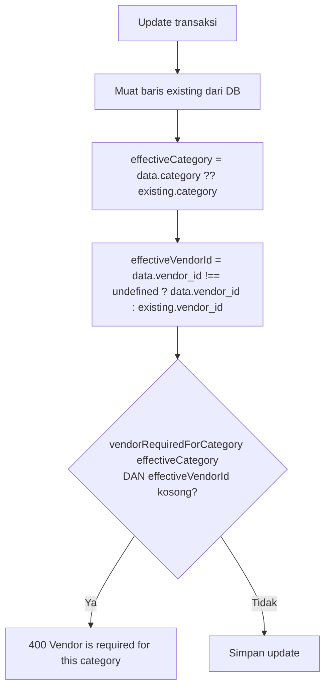
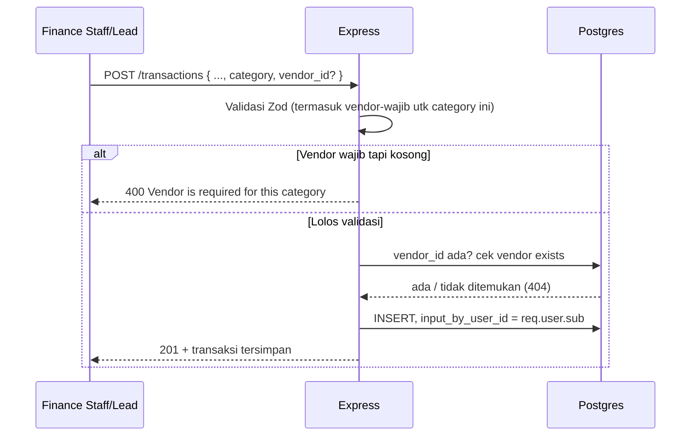

# Transaction & Vendor Service — Spesifikasi Teknis

Dokumentasi modul transaksi + vendor sebagaimana diimplementasikan, Sprint 1 (tanpa AI service).
Versi non-teknis: `transactions_vendor_overview.md`. Untuk model akun/akses, lihat `auth_user_technical.md`.

---

## Tabel `transactions`

```sql
transactions (
  id                serial PRIMARY KEY,
  transaction_date  timestamp NOT NULL,
  amount            decimal(15,2) NOT NULL,
  type              varchar(10) NOT NULL,   -- 'income' | 'expense'
  category          varchar(50) NOT NULL,
  description       text,                   -- nullable di DB, lihat catatan di bawah
  vendor_id         integer REFERENCES vendors(id),        -- nullable
  input_by_user_id  integer REFERENCES users(id)
)
```

**`description` nullable di DB tapi wajib di Zod.** `createTransactionSchema`/`updateTransactionSchema` mewajibkan string non-kosong, jadi lewat API tidak mungkin membuat transaksi tanpa deskripsi — kolomnya cuma longgar di level skema, bukan celah nyata.

**Tidak ada kolom status/soft-delete.** Berbeda dari `users` dan `vendors`, transaksi tidak punya status aktif/nonaktif — begitu tercatat, tidak ada mekanisme menyembunyikannya lewat API (tidak ada `DELETE /transactions/:id`).

**Tidak ada default di `transaction_date`** — harus selalu dikirim eksplisit oleh caller.

## Tabel `vendors`

```sql
vendors (
  id            serial PRIMARY KEY,
  vendor_name   varchar(100) NOT NULL,
  bank_account  varchar(50) NOT NULL,
  join_date     timestamp DEFAULT now(),
  status        varchar(20) DEFAULT 'active'   -- 'active' | 'inactive'
)
```

**Tidak ada unique constraint** di `vendor_name` maupun `bank_account` — baik di DB maupun Zod (`vendor.validation.js`). Dua vendor dengan nama atau rekening identik bisa didaftarkan tanpa penolakan.

**Tidak ada hard delete** — hanya `status`. Sejalan dengan prinsip yang sama pada `users`: vendor dirujuk oleh `transactions.vendor_id`, jadi menghapusnya akan merusak riwayat.

**Tidak ada kolom audit** (siapa yang membuat/mengubah vendor) — berbeda dari `transactions.input_by_user_id`.

---

## Model akses

`transaction.routes.js:15` dan `vendor.route.js:9` masing-masing cuma memasang `authenticate` — **tidak ada `requireAdmin` di endpoint manapun di kedua modul ini.** Konsisten dengan invarian di `auth_user_technical.md`: `is_admin` **hanya** menjaga `/users`. Finance Staff dan Finance Lead punya akses persis sama ke seluruh fitur transaksi dan vendor — tidak ada penyaringan data per peran maupun per user.

## Aturan "vendor wajib" (`src/constants/categories.js`)

```js
INCOME_CATEGORIES  = ['Sales', 'B2B Sales']
EXPENSE_CATEGORIES = ['Payroll & Benefits', 'Office Supplies', 'Rent & Lease',
                       'Utilities', 'Marketing & Advertising', 'Travel & Entertainment',
                       'IT & Software', 'Maintenance & Repair', 'Taxes & Licenses',
                       'Professional Fees', 'Other Expense']
ALL_CATEGORIES     = [...INCOME_CATEGORIES, ...EXPENSE_CATEGORIES]   // 13 kategori tetap

NO_VENDOR_CATEGORIES = ['Sales', 'Payroll & Benefits']
vendorRequiredForCategory = (category) => !NO_VENDOR_CATEGORIES.includes(category)
```

Kategori ini **hardcoded**, bukan tabel DB — tidak ada endpoint atau UI untuk mengelolanya. Menambah/mengubah kategori berarti mengubah kode.

`vendorRequiredForCategory` adalah **satu-satunya sumber kebenaran** aturan ini, dipakai di dua tempat dengan cara berbeda karena constraint yang berbeda:

- **Create** — dicek lewat Zod `superRefine` (`transaction.validation.js`): kategori sudah pasti ada di body yang sama, jadi bisa dicek langsung di skema. Gagal → 400, `path: ['vendor_id']`.
- **Update** — dicek di `TransactionService.update` (`transaction.service.js:83-91`), **bukan** di Zod. Alasannya: pada partial update, kategori atau vendor final bisa saja tidak dikirim sama sekali (dipertahankan dari baris lama), jadi yang perlu dicek adalah **kombinasi efektif** — kategori baru (kalau dikirim) atau kategori lama (kalau tidak), digabung dengan vendor baru (kalau dikirim) atau vendor lama. Ini cuma bisa dihitung setelah baris existing dimuat dari DB, sehingga tidak mungkin dicek di level skema request saja.



Catatan implementasi: `data.vendor_id !== undefined` (bukan truthy check) sengaja dipakai supaya klien bisa mengirim `vendor_id: null` untuk **menghapus** vendor dari transaksi, dibedakan dari tidak mengirim field itu sama sekali (artinya "biarkan seperti semula").

**Frontend tidak menampilkan aturan ini.** Form transaksi (`sentinel/app/(dashboard)/transactions/page.tsx`) memberi label "Vendor (Optional)" secara statis untuk semua kategori — tidak berubah jadi wajib walau kategori yang dipilih mewajibkannya. User baru tahu lewat pesan error 400 setelah submit.

## Endpoint

### Transactions

| Method | Path | Akses | Body / Catatan |
| :--- | :--- | :--- | :--- |
| POST | `/transactions` | login | Body sesuai `createTransactionSchema`; `input_by_user_id` **selalu** dari `req.user.sub`, bukan dari body |
| GET | `/transactions` | login | Query: `page`, `limit` (maks 100), `type`, `category`, `search` |
| GET | `/transactions/categories` | login | `?type=income` → `{income:[...]}`; `?type=expense` → `{expense:[...]}`; tanpa/`type` lain → keduanya |
| GET | `/transactions/:id` | login | Detail satu transaksi, termasuk `bank_account` vendor via join |
| PUT | `/transactions/:id` | login | Partial update, lihat aturan vendor-wajib di atas |

Tidak ada `DELETE /transactions/:id` — transaksi tidak pernah dihapus lewat API sama sekali (bukan sekadar soft-delete, memang tidak ada endpointnya).

### Vendors

| Method | Path | Akses | Body / Catatan |
| :--- | :--- | :--- | :--- |
| POST | `/vendors` | login | `{ vendor_name, bank_account, status? }` |
| GET | `/vendors` | login | **Tidak ada parameter apapun** — selalu mengembalikan semua vendor, urut `join_date desc` |
| GET | `/vendors/:id` | login | Detail satu vendor |
| PUT | `/vendors/:id` | login | Partial update, termasuk ganti `status` |

Tidak ada `DELETE /vendors/:id`.

---

## Alur

### Catat transaksi baru



### Toggle status vendor

`PUT /vendors/:id { status: 'inactive' }` — langsung berlaku, tidak ada efek berantai ke tabel `transactions`. `VendorService.update` (`vendor.service.js`) hanya melakukan `UPDATE vendors SET ... WHERE id = ?`; tidak pernah menyentuh atau memvalidasi ulang baris `transactions` yang merujuknya. Transaksi lama tetap menampilkan nama vendor apa adanya lewat `LEFT JOIN`, terlepas dari status vendor saat ini.

Konsekuensinya di frontend (`vendors/page.tsx`): vendor nonaktif hilang dari dropdown pemilihan **transaksi baru**, tapi tetap muncul sebagai pilihan **kalau sedang mengedit transaksi yang sudah memakainya** (filter di `TransactionDialog`: `status === 'active' || vendor.id === txToEdit.vendor_id`).

---

## Invarian

- `input_by_user_id` selalu diambil dari sesi (`req.user.sub`), tidak pernah dari body — konsisten dengan prinsip audit trail yang sama di modul auth/user.
- `vendorRequiredForCategory` adalah satu-satunya sumber kebenaran aturan vendor-wajib; create dan update sama-sama memanggilnya, tidak ada logika duplikat yang bisa drift.
- Vendor dan transaksi tidak pernah di-hard-delete.
- Menonaktifkan vendor tidak pernah mengubah transaksi yang sudah ada.
- `ALL_CATEGORIES` adalah daftar tetap (13 kategori) — tidak dikelola lewat DB atau UI.

---

## Kesenjangan yang diketahui

- **Frontend tidak menandai vendor sebagai wajib** untuk kategori yang membutuhkannya — baru gagal setelah submit. Perbaikan sederhana: tandai field secara dinamis berdasarkan `vendorRequiredForCategory(category)` (perlu diekspos ke frontend, saat ini logikanya cuma ada di backend).
- **`GET /vendors` tidak punya pagination/filter/search di level DB sama sekali** — `VendorsQuery.findAll()` selalu mengembalikan seluruh tabel. Berbeda dari `GET /transactions` yang sudah mendukung `page`/`limit`/`search` penuh. Bukan bug regresi (backend memang tidak pernah menawarkan lebih), tapi jadi limit yang nyata begitu jumlah vendor bertambah banyak.
- **`GET /transactions` tidak punya filter `vendor_id` maupun parameter `sort`** di level DB — frontend punya UI filter-by-vendor dan sort-by, tapi keduanya cuma beroperasi di atas satu halaman hasil yang sudah datang dari server, bukan di seluruh data (dicatat juga di `transactions/page.tsx` sebagai keterbatasan yang disadari).
- **Vendor tidak punya kolom audit** (`created_by`/`updated_by`) — tidak seperti transaksi, tidak ada jejak siapa mendaftarkan atau mengubah data vendor.
- **`ImportDialog` dan `VendorDrawer` di frontend murni UI mock** — tidak terhubung ke endpoint manapun; upload Excel dan panel detail vendor (skor risiko, riwayat transaksi) menampilkan data statis, sama untuk kasus apapun.
- **Salah tempel copy**: judul halaman Transaksi (`transactions/page.tsx`) masih menampilkan subjudul "Manage Finance Lead and Finance Staff accounts" — jelas tersalin dari halaman Administration, bukan deskripsi fitur transaksi. Kosmetik, tidak memengaruhi fungsi.
- **Kolom "Division" di tabel transaksi selalu menampilkan teks statis "Global"** — tidak ada kolom `department`/`division` di skema `transactions` (dan memang sengaja dihapus dari `users` juga, lihat `auth_user_technical.md`). Kalau memang tidak akan dipakai, sebaiknya kolom ini dihapus dari tampilan, bukan diisi placeholder yang terlihat seperti data asli.
