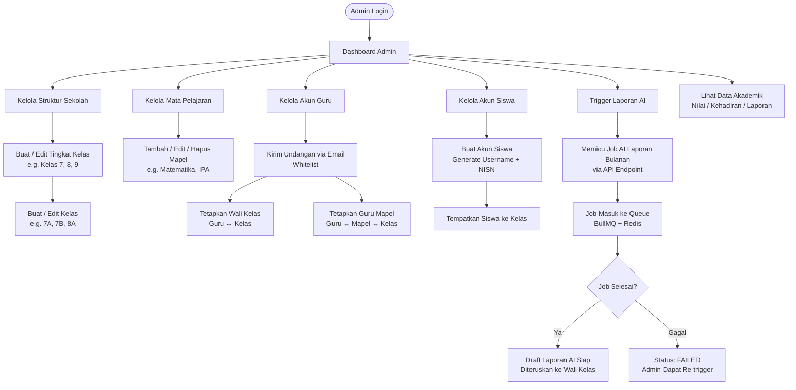
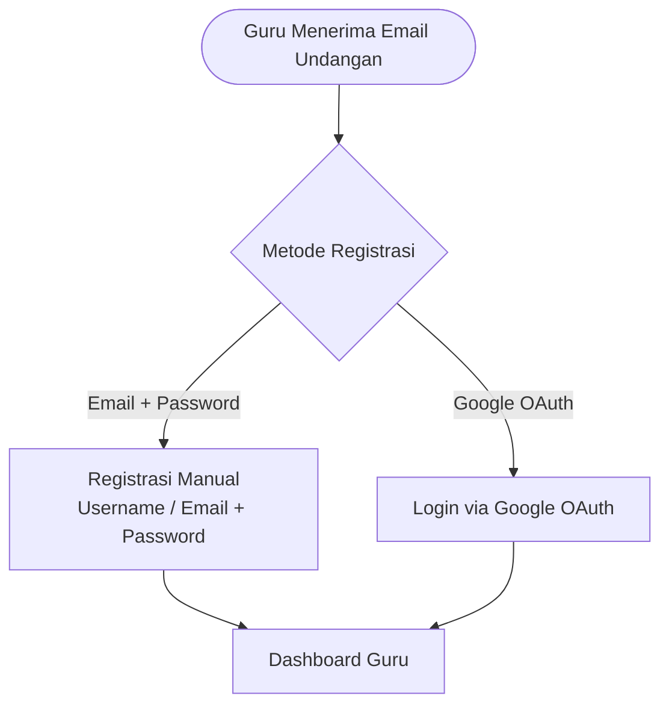
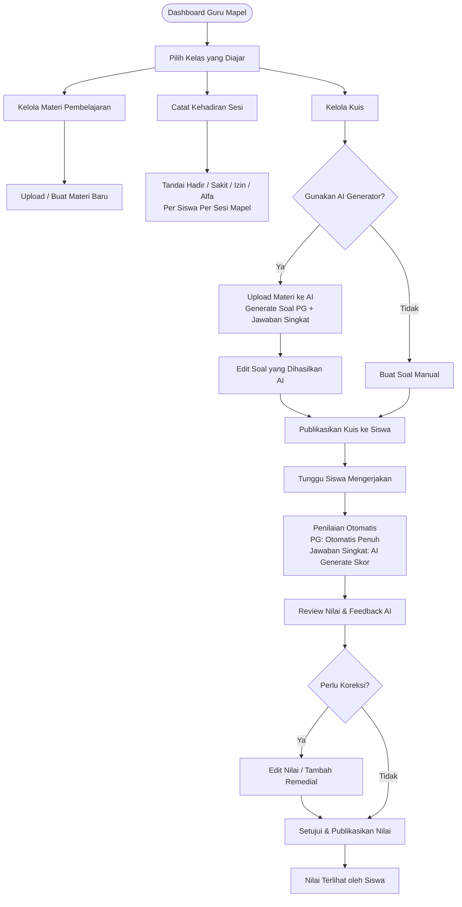
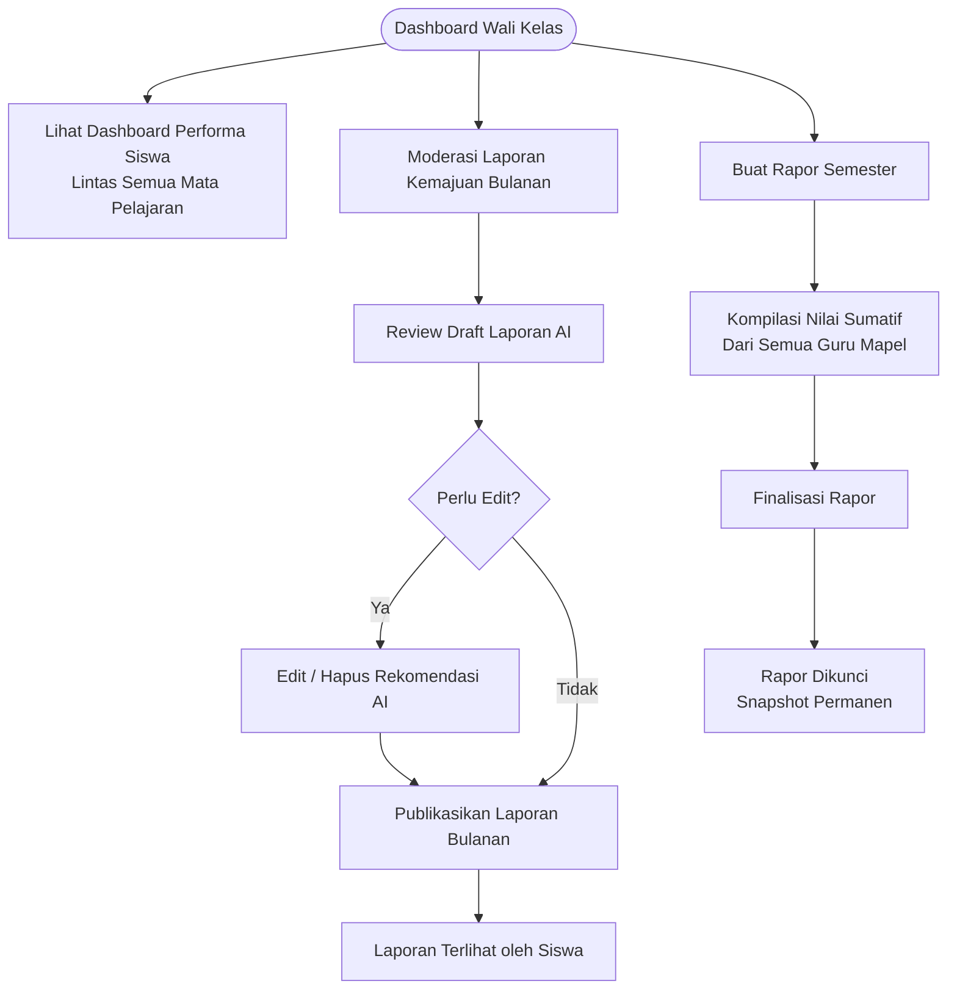
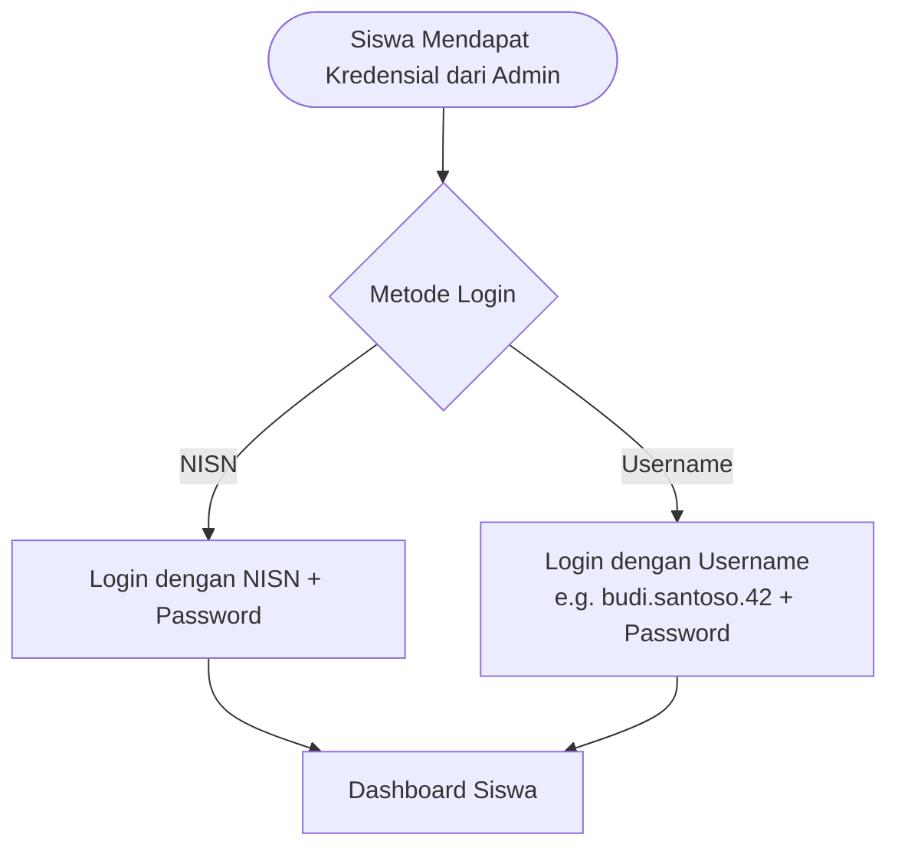
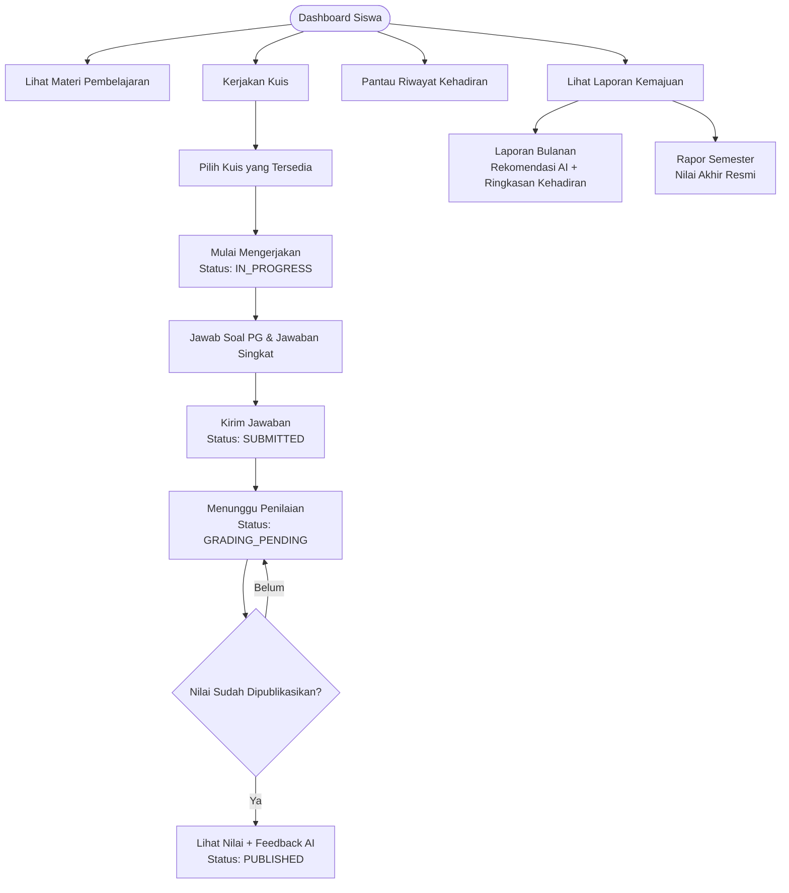
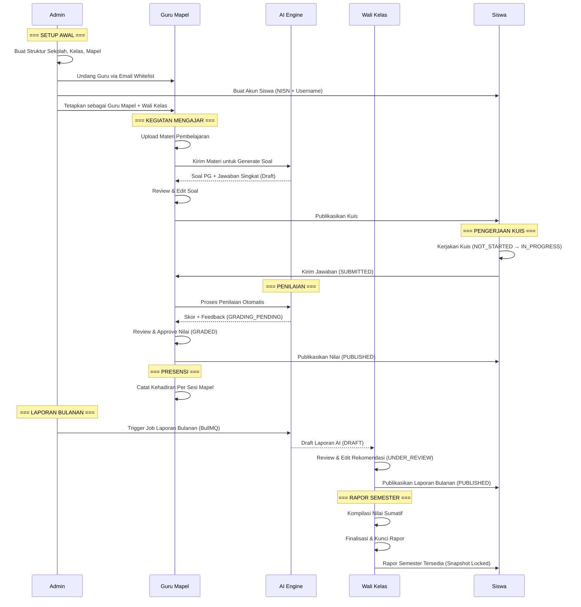

# 🔄 Eleva LMS - User Flow (Bagan Alir Pengguna)

Dokumen ini menggambarkan alur interaksi pengguna (*user flow*) untuk setiap peran dalam sistem **Eleva LMS**, berdasarkan spesifikasi pada [design.md](file:///c:/Users/Hp/Documents/projects/kada/capstone/eleva-backend/docs/design.md) dan [deps_tree.md](file:///c:/Users/Hp/Documents/projects/kada/capstone/eleva-backend/docs/deps_tree.md).

---

## 👨‍💼 Admin Flow

Admin adalah pengguna pertama yang menggunakan sistem. Semua data master (sekolah, kelas, mapel, akun guru & siswa) dikelola oleh Admin.

---

## 👨‍🏫 Guru Flow (Wali Kelas + Guru Mata Pelajaran)

Satu akun guru dapat memiliki peran ganda: **Wali Kelas** dan/atau **Guru Mata Pelajaran**. UI menyesuaikan fitur berdasarkan peran yang ditugaskan.

### Alur Registrasi Guru

### Alur Guru Mata Pelajaran

### Alur Wali Kelas

---

## 👨‍🎓 Siswa Flow

Siswa tidak melakukan registrasi mandiri. Semua akun dibuat oleh Admin (Lihat rincian teknis di [auth-siswa.md](file:///e:/file%20rivan/Bootcamp/KADA-BATCH-4/Eleva-Capstone/eleva-backend/docs/technical/auth-siswa.md)).

### Alur Login Siswa

### Alur Aktivitas Siswa

---

## 🔄 Alur Interaksi Antar Peran (Cross-Role Interaction)

Diagram berikut menunjukkan bagaimana ketiga peran saling berinteraksi dalam satu siklus akademik lengkap.

---

## 📊 Ringkasan Status Transisi Per Peran

| Entitas | Status Flow | Aktor yang Mengubah |
| :--- | :--- | :--- |
| **Kuis (Quiz)** | `NOT_STARTED` → `IN_PROGRESS` → `SUBMITTED` → `GRADING_PENDING` → `GRADED` → `PUBLISHED` | Siswa (submit) → AI (grade) → Guru (review & publish) |
| **Laporan Bulanan** | `DRAFT` → `UNDER_REVIEW` → `PUBLISHED` | AI (generate) → Wali Kelas (review & publish) |
| **Job AI (Queue)** | `PENDING` → `PROCESSING` → `COMPLETED` / `FAILED` | Admin (trigger) → System (process) |
| **Rapor Semester** | Draft → Finalized → Locked | Wali Kelas (compile & lock) |
